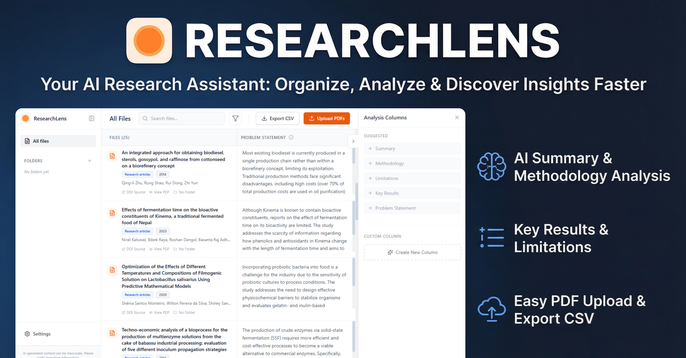

# ResearchLens: Automated Scientific Literature Analysis System

[](https://doi.org/10.5281/zenodo.18009145)



## Abstract
ResearchLens is a desktop application designed to address the critical challenge of information overload in academic research. By leveraging the multimodal capabilities of Large Language Models (LLMs), specifically Google's Gemini architecture, it automates the extraction, analysis, and synthesis of data from scientific PDFs. The software provides a local-first, privacy-preserving environment for researchers to process literature at scale, ensuring high fidelity in bibliographic metadata extraction and semantic analysis without relying on traditional, error-prone OCR pipelines.

---

## 1. Purpose of the Software

In the modern scientific landscape, researchers are inundated with an ever-growing volume of literature. Traditional methods of manual review are time-consuming and prone to human error. Existing automated tools often rely on brittle text extraction methods that fail to capture the nuance of complex document layouts, tables, and non-linear text.

**ResearchLens** was developed to:
1.  **Accelerate Literature Review**: Drastically reduce the time required to screen and analyze papers.
2.  **Enhance Data Accuracy**: Utilize multimodal AI to "see" documents as humans do, preserving context often lost in plain-text conversion.
3.  **Facilitate Structured Synthesis**: Convert unstructured PDF content into structured, exportable data (JSON/CSV) suitable for bibliometric analysis and systematic reviews.
4.  **Ensure Data Sovereignty**: Operate within a local environment where research data remains on the user's machine, addressing privacy concerns associated with cloud-only platforms.

---

## 2. Installation

ResearchLens AI is built on a modern web technology stack (Electron, React, TypeScript) and can be installed on Windows, macOS, or Linux.

### Prerequisites
*   **Google Gemini API Key**: Required for AI processing. Get one [here](https://aistudio.google.com/app/apikey).
*   **Node.js**: (For building from source only) v16 or higher.

### Option A: Windows Installer (Recommended)

For Windows users, the easiest way to install ResearchLens AI is via the pre-built installer:

1.  **Download**: Visit the [Official Release Page](https://github.com/foffano/researchlens/releases/).
2.  **Install**: Download the `.exe` file and run it. The application will automatically install and launch.

3.  **Note on Windows Security**:
    Since this is an open-source project without a paid code signing certificate, Windows Defender SmartScreen may flag the installer as "unrecognized".
    *   Click **"More info"** → **"Run anyway"** to proceed.
    *   This is a standard warning for unsigned software on Windows.

### Option B: Running from Source (For Developers)

1.  **Clone the Repository**:
    ```bash
    git clone https://github.com/foffano/researchlens.git
    cd researchlens
    ```

2.  **Install Dependencies**:
    ```bash
    npm install
    ```

3.  **Launch Application**:
    *   **Development Mode** (Hot-reload enabled):
        ```bash
        npm run electron:dev
        ```
    *   **Production Build**:
        To create an executable installer:
        ```bash
        npm run electron:build
        ```
        The output files will be generated in the `release` directory (e.g., `release/win-unpacked/ResearchLens AI.exe`).

---

## 3. Use

The typical workflow for a researcher using ResearchLens AI follows three main stages: **Import**, **Analysis**, and **Synthesis**.

### Step 1: Configuration
Upon first launch, navigate to the **Settings** (gear icon) in the sidebar.
1.  Enter your **Google Gemini API Key**.
2.  Select your preferred **Model Version** (e.g., `gemini-2.5-flash` for speed, or `gemini-3-pro-preview` for complex reasoning).

### Step 2: Document Ingestion
*   **Import**: Drag and drop PDF files directly into the application window.
*   **Organization**: Create project-specific folders to manage distinct literature sets (e.g., "Systematic Review 2024").

### Step 3: Automated Analysis
The software automatically performs a two-phase analysis on every uploaded document:

1.  **Bibliographic Extraction**: Automatically identifies Title, Authors, Publication Year, DOI, and Document Type (e.g., Clinical Trial, Review Article).
2.  **Semantic Querying**:
    *   Use the "Custom Columns" feature to ask specific research questions across your entire library.
    *   *Example Queries*: "What was the sample size?", "What statistical tests were used?", "Limitaitons of the study".
    *   The system extracts these specific data points for every paper in the folder.

### Step 4: Export and Synthesis
*   **Data Export**: Click the "Export" button to generate a CSV file containing all extracted metadata and analysis results. This file is formatted for direct import into statistical software (SPSS, R) or spreadsheet managers (Excel) for the final stages of your systematic review.

---

## 4. Scientific Methodology & System Architecture

ResearchLens AI employs a novel architecture designed to maximize trust and reproducibility in AI-assisted research.

### Direct Multimodal Processing
Unlike systems that use OCR (Optical Character Recognition) to convert PDFs to error-prone text, ResearchLens AI transmits the **raw PDF binary** directly to the multimodal context window of the underlying Large Language Model.
*   **Benefit**: The model perceives layout, charts, footnotes, and sidebars essentially as a human reader would, significantly reducing hallucination rates caused by broken text streams.

### Structured Extraction Protocol
To ensure scientific rigor, the system uses a **Dual-Phase Dynamic Prompting** strategy enforced by a strict JSON schema:
*   **Schema Enforcement**: The output is constrained to a rigorous structure. This guarantees that fields like "Results" or "Methodology" are returned as consistent data types, eliminating unstructured "chatty" responses common in general-purpose chatbots.

### Data Integrity
*   **Atomic Analysis**: Each document analysis is an independent transaction.
*   **Traceability**: Results are watermarked with the specific model version used, allowing researchers to report exactly which AI model assisted in their review.

---

## 5. Technical Specifications

*   **Framework**: Electron (Cross-platform desktop runtime)
*   **Frontend**: React + TypeScript + Tailwind CSS
*   **AI Engine**: Google GenAI SDK (Gemini Models)
*   **Build System**: Vite

## 6. License

This project is licensed under the **Apache-2.0 License** - see the [LICENSE](LICENSE) file for details.
